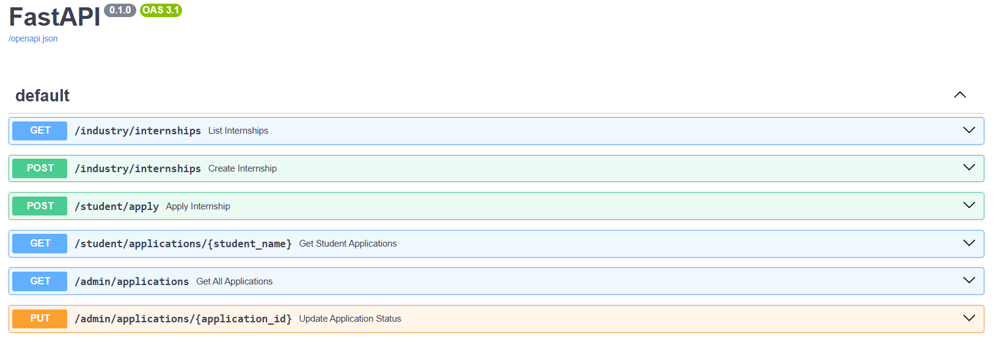

 # Working functions

 ### > Student portal - Able to apply the available internship 
 ### > Industry portal - Can post intership opportinites

### > Admin - portal same as it is till

# Functions we need to include

### > Student portal - Improve user profile UI , Add Upload resume option , Able to see Allocated result

### > Industry portal -No major changes

### > Admin portal - Able to start the allocation process
 
## ! Try to improve overall UI 
 
 
 # Intruction to run frontend

 ### Install node.js 

 ```cmd

 cd pm_internship_allocation\frontend\PM-intership

 npm install

 npm run dev 
 ```

 # To run backend

 ```cmd
cd pm_internship_allocation\backend

pip install fastapi uvicorn

uvicorn main:app
 ```

 # Available backend API's
 

 # While pushing code to github create new branch and push to the branch